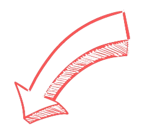
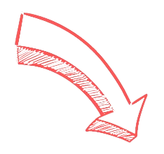

<!DOCTYPE html>
<html lang="en">
<head>
  <meta charset="UTF-8">
  <meta name="viewport" content="width=device-width, initial-scale=1.0">
  <link href="https://fonts.googleapis.com/css2?family=Montserrat:wght@300;500&display=swap" rel="stylesheet">
  
  <title>Responsive Timeline</title>
</head>
<body style="margin: 0; padding: 0; box-sizing: border-box; font-family: 'Montserrat', sans-serif; background-color: #111;">
  

  
  

  

    

      <ul>
        <li style="left:30%">
          

            
          

          

            

              
            

            <h3 style="font-size: 12px; font-weight: 300; margin-bottom: 10px; margin-top:0px; letter-spacing: 2px;">20th May, 2010</h3>
            <h1 style="font-weight: 500; font-size: 25px; line-height: 30px; margin-bottom: 0px; margin-top:0px;">Heading 3</h1>
            
Lorem ipsum dolor sit amet consectetur adipisicing elit. Consectetur tempora ab laudantium voluptatibus aut eos placeat laborum, quibusdam exercitationem labore.

          

        </li>
        <li style="right:0%">
          

            

              
            

            <h3 style="font-size: 12px; font-weight: 300; margin-bottom: 10px; margin-top:0px; letter-spacing: 2px;">20th May, 2010</h3>
            <h1 style="font-weight: 500; font-size: 25px; line-height: 30px; margin-bottom: 10px; margin-top:0px;">Heading 2</h1>
            
Lorem ipsum dolor sit amet consectetur adipisicing elit. Consectetur tempora ab laudantium voluptatibus aut eos placeat laborum, quibusdam exercitationem labore.

          

          

            
          

        </li>
        <li style="left:30%">
          

            
          

          

            

              
            

            <h3 style="font-size: 12px; font-weight: 300; margin-bottom: 10px; margin-top:0px; letter-spacing: 2px;">20th May, 2010</h3>
            <h1 style="font-weight: 500; font-size: 25px; line-height: 30px; margin-bottom: 0px; margin-top:0px;">Heading 3</h1>
            
Lorem ipsum dolor sit amet consectetur adipisicing elit. Consectetur tempora ab laudantium voluptatibus aut eos placeat laborum, quibusdam exercitationem labore.

          

        </li>
        <li style="right:0%">
          

            

              
            

            <h3 style="font-size: 12px; font-weight: 300; margin-bottom: 10px; margin-top:0px; letter-spacing: 2px;">20th May, 2010</h3>
            <h1 style="font-weight: 500; font-size: 25px; line-height: 30px; margin-bottom: 10px; margin-top:0px;">Heading 4</h1>
            
Lorem ipsum dolor sit amet consectetur adipisicing elit. Consectetur tempora ab laudantium voluptatibus aut eos placeat laborum, quibusdam exercitationem labore.

          

        </li>
      </ul>
    

  

</body>
</html>
